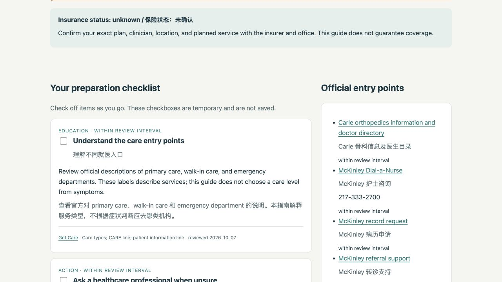

# ClearCare

**A bilingual appointment preparation guide for international students learning to navigate healthcare in the U.S.**

ClearCare turns reviewed public information into a practical checklist: where to find an official appointment entry, what to ask a clinic or insurer, which documents to prepare, and what remains unconfirmed. It uses Python, DuckDB, and SQL, with a small HTML output that works without a web server.

The motivating scenario is a student arranging follow-up after a fracture and facing unfamiliar booking, referral, and insurance steps. The first version focuses on UIUC students in Champaign–Urbana, Illinois. This local scope makes the information easier to check and the project possible to reproduce.



**Research question:** How can source-linked, scenario-specific information help a newcomer prepare for an appointment without presenting uncertain insurance or service information as confirmed?

## Start with the results

- [Fracture follow-up guide](examples/fracture_followup.md): the main demonstration, in English and Chinese.
- [HTML guide](examples/fracture_followup.html): download and open in a browser for checkboxes and printing. GitHub's file view shows the HTML source.
- [Evaluation report](docs/evaluation.md): 30 predefined software scenarios passed.
- [Research design](docs/research_design.md): scope, source selection, coding method, and remaining research work.

The reviewed snapshot contains **16 primary sources, 4 service locations, 6 advertised location–service relationships, and 22 preparation steps**. It supports three scenarios: a campus appointment, a community appointment, and fracture follow-up after an initial assessment. An emergency entry skips the preparation workflow.

There are **no real insurance-network observations** in this version. The production result is `unknown`, and coverage is never marked as confirmed. Synthetic records test how SQL handles new, expired, missing, and conflicting observations; they are excluded from user guides and removed after evaluation.

## Reproduce the complete workflow

Use **Python 3.12** for the tested environment. No API key or paid service is needed. Commands below run from the repository root. The virtual environment stays inside this project.

```bash
git clone https://github.com/ShroudXK/clearcare.git
cd clearcare
python3 -m venv .venv
source .venv/bin/activate
python -m pip install -r requirements.txt
python -m unittest discover -s tests -v
python -m clearcare pipeline --as-of 2026-10-07 --output build
python scripts/verify_examples.py
```

On Windows, activate with `.venv\Scripts\activate` instead. If `python3` is unavailable, use the command for your installed Python 3.12 interpreter.

Expected result: **24 regression tests pass; 30/30 evaluation scenarios pass; 0 data quality issues.** These checks overlap because one regression test reruns the scenario evaluation; neither is a user study. GitHub Actions repeats the tests and snapshot workflow on Linux.

The pipeline creates:

| Output | Purpose |
|---|---|
| `build/clearcare.duckdb` | Validated relational database |
| `build/guides/` | JSON, Markdown, and HTML guides for all three scenarios and emergency entry |
| `build/data_quality.json` | Table counts, integrity checks, and source review states |
| `build/evaluation.json` | Expected and actual results for each software scenario |
| `build/source_freshness.csv` | Sources requiring review for the selected date |
| `build/advertised_imaging_services.csv` | A multi-table SQL query with source and scope notes |
| `build/run_manifest.json` | Dataset, software versions, selected date, and run results |

Open `build/guides/fracture_followup.html` in a browser. The fixed date reproduces the reviewed demonstration; it does not claim that information is current on a later date. Database file bytes can differ between platforms, while the selected records and guide text are reproducible.

For a different preparation profile:

```bash
python -m clearcare guide --scenario fracture_followup \
  --needs-interpreter --no-insurance-card --no-prior-records \
  --as-of 2026-10-07
```

For a present-day guide, omit `--as-of`; the `guide` command uses the local current date and flags expired reviews. Its inputs are scenario and preparation flags, not symptoms, names, or medical records. See the [workflow guide](docs/workflow.md) and [notebook](notebooks/walkthrough.ipynb) for more examples.

## Research and data sources

The dataset uses official pages from **McKinley Health Center, Carle Health, HealthCare.gov, CMS, and the National Library of Medicine**. The [source catalog](docs/source_catalog.md) provides each URL, relevant section, review date, and limitations.

One important local finding is that McKinley's Health Service Fee is separate from student insurance and does not pay for outside care, including referrals. ClearCare uses this distinction in the campus scenario. [McKinley fee information](https://mckinley.illinois.edu/fees/health-service-fee)

The collection method combines source retrieval with desk review. Python downloads pages, extracts text, records SHA-256 hashes, and checks short anchors. Guidance is then summarized and linked to its sources. **A successful download or matching phrase does not prove that a summary is accurate.** The [initial retrieval log](data/curated/retrieval_baseline.json) records 16 successful retrievals with matching anchors. Review notes explain what was retained and what was left uncertain.

Chinese text is a project translation, not an official translation or a medically reviewed translation. The CMS preparation PDF was revised in July 2018 and is used only for general visit preparation. Current local booking details come from local official pages.

To check live sources separately:

```bash
python -m clearcare check-sources --output build/source_check
```

This downloads pages into an ignored local folder. It flags failures, missing anchors, and changed bytes, but **does not update the dataset or its review dates**. Dynamic pages can change bytes without changing their meaning. Live checks may return exit code `2` when review is needed. Full third-party pages are not redistributed in this repository.

## Python and SQL design

Python handles retrieval, orchestration, dependency ordering, rendering, and tests. SQL handles typed ingestion, relational constraints, scenario selection, joins, aggregation, and evidence dates.

- [`schema.sql`](sql/schema.sql): primary keys, composite keys, foreign keys, and checks across 11 data tables plus run metadata.
- [`guide_steps.sql`](sql/guide_steps.sql): conditional steps with source aggregation; `EXISTS` prevents duplicate checklist items.
- [`network_status.sql`](sql/network_status.sql): exact plan–provider–location matching, latest records per evidence channel, expiration checks, and conflict detection using a CTE and window function.
- [`facility_services.sql`](sql/facility_services.sql): advertised services joined to locations and source notes.
- [`data_quality.sql`](sql/data_quality.sql): missing evidence, incomplete translations, future review dates, and synthetic-data contamination checks.

The builder verifies input checksums, loads a new database in a transaction, and replaces the previous build only after validation succeeds. A failed rebuild preserves the previous database. User values use bound SQL parameters. [Data dictionary and relationship diagram](docs/data_dictionary.md)

## Problems encountered and solutions

| Problem | What this project does |
|---|---|
| A Carle detail page was inconsistently accessible during browsing | Use the official service-level page for the supported location listing; leave the unverified street address blank. Record source-check failures instead of guessing. |
| Local fees can be confused with insurance coverage | Store and explain the campus fee mechanism separately; direct users to verify outside-care coverage. |
| No reliable plan-specific network evidence was collected | Keep production network tables empty; test resolution logic with labeled synthetic fixtures. |
| Source pages or policies may change | Separate deterministic snapshot replay from live retrieval checks; replace expired guide text with a review prompt. |
| Rebuilding tables with foreign keys can cause dependency errors | Build a separate database in parent-before-child order and validate before replacement. |
| Duplicate tags can duplicate checklist rows | Use `EXISTS` for scenario matching and test that step IDs remain unique. |

For environment, file-lock, checksum, and source-check troubleshooting, see [workflow and troubleshooting](docs/workflow.md).

## Limits and next steps

This is a research prototype for public-information navigation. It does not diagnose, determine clinical urgency, book appointments, verify eligibility, or calculate a final bill. In a medical emergency, call 911 or seek an emergency department; do not delay care for this checklist. [Official emergency guidance](https://www.healthcare.gov/using-marketplace-coverage/getting-emergency-care/)

The dataset is small and locally focused. Review intervals are project maintenance choices, not guarantees of accuracy. Services, interpreter arrangements, office availability, and insurer rules still require confirmation. The software evaluation checks defined behavior; **no student usability sessions, clinical review, or improvement in healthcare outcomes have been measured**.

Next steps are to test appointment-preparation tasks with international students, review wording with a healthcare professional, improve Chinese translation, and add plan-specific data only when its scope and update process can be verified. The [future user-study protocol](docs/research_design.md) explains how task completion, time, and misunderstanding could be measured.

This project extends an introductory relational-model lab into an end-to-end workflow. AI assistance was used for implementation, source collection, testing, and documentation. Design decisions, source limits, and tests are documented so the work can be reviewed and extended. The repository does not claim unperformed user research or independent clinical validation.

Code and original project materials use the MIT License. Linked source pages retain their original ownership and terms; see [data attribution](data/README.md).
