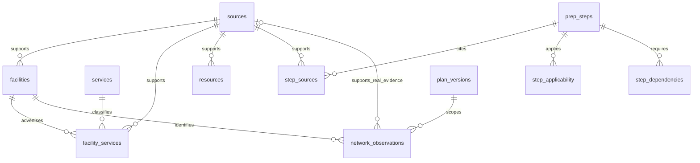

# Data dictionary

The database contains 11 CSV-backed tables and one generated metadata table. Primary, composite, and foreign keys are defined in [`schema.sql`](../sql/schema.sql). Empty production insurance tables are intentional.

This diagram summarizes table relationships; `step_dependencies` also references a second preparation step. Individual provider identity is retained as an exact key in network observations because a facility-wide label cannot establish a named clinician's network participation.

## `dataset_meta` — 1 snapshot rows

| Field | Type | Nullable | Key | Meaning |
|---|---|---|---|---|
| `dataset_version` | VARCHAR | NO | — | Reviewed snapshot version. |
| `input_sha256` | VARCHAR | NO | — | Combined digest of curated CSV and dataset metadata hashes. |
| `source_review_date` | DATE | NO | — | Dataset review date stored at build time. |

## `facilities` — 4 snapshot rows

| Field | Type | Nullable | Key | Meaning |
|---|---|---|---|---|
| `facility_id` | VARCHAR | NO | PRI | Location identifier; not a clinician identifier. |
| `name` | VARCHAR | NO | — | Public institutional name. |
| `care_type` | VARCHAR | NO | — | campus, walk_in, or emergency; an institutional category, not a triage result. |
| `city` | VARCHAR | NO | — | City in the bounded project geography. |
| `address` | VARCHAR | YES | — | Verified public address; NULL when not collected/verified. |
| `phone` | VARCHAR | YES | — | Public institutional contact; NULL when not collected. |
| `entry_url` | VARCHAR | NO | — | Official public entry page. |
| `source_id` | VARCHAR | NO | — | Primary-source identifier; child tables use it to retain attribution. |
| `scope_note` | VARCHAR | NO | — | Limits of the advertised information; not a guarantee of availability. |

## `facility_services` — 6 snapshot rows

| Field | Type | Nullable | Key | Meaning |
|---|---|---|---|---|
| `facility_id` | VARCHAR | NO | PRI | Location identifier; not a clinician identifier. |
| `service_id` | VARCHAR | NO | PRI | Service category identifier. |
| `source_id` | VARCHAR | NO | — | Primary-source identifier; child tables use it to retain attribution. |
| `scope_note` | VARCHAR | NO | — | Limits of the advertised information; not a guarantee of availability. |

## `network_observations` — 0 snapshot rows

| Field | Type | Nullable | Key | Meaning |
|---|---|---|---|---|
| `observation_id` | VARCHAR | NO | PRI | Unique network observation key. |
| `facility_id` | VARCHAR | NO | — | Location identifier; not a clinician identifier. |
| `provider_key` | VARCHAR | NO | — | Exact clinician identity key; production identifiers are not yet collected. |
| `plan_id` | VARCHAR | NO | — | An exact plan-version key, not an insurer name. |
| `source_id` | VARCHAR | YES | — | Primary-source identifier; child tables use it to retain attribution. |
| `evidence_channel` | VARCHAR | NO | — | A source_id for real evidence, or a fictional demo channel. |
| `status` | VARCHAR | NO | — | in_network, out_of_network, or unknown; not service coverage. |
| `observed_on` | DATE | NO | — | Observation date; future observations are ignored for historical queries. |
| `valid_until` | DATE | NO | — | Observation expiration date; a separate maximum age of 30 days is also applied. |
| `is_synthetic` | BOOLEAN | NO | — | True only for fictional test evidence; excluded from user guides. |

## `plan_versions` — 0 snapshot rows

| Field | Type | Nullable | Key | Meaning |
|---|---|---|---|---|
| `plan_id` | VARCHAR | NO | PRI | An exact plan-version key, not an insurer name. |
| `plan_name` | VARCHAR | NO | — | Plan label; all current fixture labels are explicitly fictional. |
| `network_name` | VARCHAR | NO | — | Plan network label. |
| `effective_from` | DATE | NO | — | First date of the plan version's stated period. |
| `effective_to` | DATE | NO | — | Last date of the plan version's stated period. |
| `is_synthetic` | BOOLEAN | NO | — | True only for fictional test evidence; excluded from user guides. |

## `prep_steps` — 22 snapshot rows

| Field | Type | Nullable | Key | Meaning |
|---|---|---|---|---|
| `step_id` | VARCHAR | NO | PRI | Preparation item identifier. |
| `sort_order` | INTEGER | NO | — | Preferred display order, subject to prerequisite ordering. |
| `kind` | VARCHAR | NO | — | education, action, or question; questions do not assert a requirement. |
| `title_en` | VARCHAR | NO | — | English item heading. |
| `title_zh` | VARCHAR | NO | — | Project Chinese translation of the heading. |
| `body_en` | VARCHAR | NO | — | Source-derived English summary or confirmation prompt. |
| `body_zh` | VARCHAR | NO | — | Project Chinese translation. |
| `condition_key` | VARCHAR | NO | — | Boolean preparation condition used by guide_steps.sql. |

## `resources` — 8 snapshot rows

| Field | Type | Nullable | Key | Meaning |
|---|---|---|---|---|
| `resource_id` | VARCHAR | NO | PRI | Official navigation entry identifier. |
| `scenario` | VARCHAR | NO | — | all or one of the three supported preparation scenarios. |
| `title_en` | VARCHAR | NO | — | English item heading. |
| `title_zh` | VARCHAR | NO | — | Project Chinese translation of the heading. |
| `url` | VARCHAR | NO | — | Official HTTPS source or entry URL. |
| `phone` | VARCHAR | YES | — | Public institutional contact; NULL when not collected. |
| `source_id` | VARCHAR | NO | — | Primary-source identifier; child tables use it to retain attribution. |

## `services` — 4 snapshot rows

| Field | Type | Nullable | Key | Meaning |
|---|---|---|---|---|
| `service_id` | VARCHAR | NO | PRI | Service category identifier. |
| `name_en` | VARCHAR | NO | — | English service name. |
| `name_zh` | VARCHAR | NO | — | Project Chinese translation of the service name. |

## `sources` — 16 snapshot rows

| Field | Type | Nullable | Key | Meaning |
|---|---|---|---|---|
| `source_id` | VARCHAR | NO | PRI | Primary-source identifier; child tables use it to retain attribution. |
| `publisher` | VARCHAR | NO | — | Institution responsible for the official information. |
| `title` | VARCHAR | NO | — | Source page or document title. |
| `url` | VARCHAR | NO | — | Official HTTPS source or entry URL. |
| `format` | VARCHAR | NO | — | html or pdf, used by the retrieval parser. |
| `locator` | VARCHAR | NO | — | Relevant heading or one-based PDF page range. |
| `review_interval_days` | INTEGER | NO | — | Project maintenance threshold, not a factual accuracy guarantee. |
| `publication_note` | VARCHAR | YES | — | Published version/date when observed; blank means not collected. |
| `anchors` | VARCHAR | NO | — | Short pipe-separated phrases used for retrieval checks. |
| `reviewed_on` | DATE | NO | — | Date of this project's source-content review. |
| `review_method` | VARCHAR | NO | — | Description of the review performed in this project. |

## `step_applicability` — 27 snapshot rows

| Field | Type | Nullable | Key | Meaning |
|---|---|---|---|---|
| `step_id` | VARCHAR | NO | PRI | Preparation item identifier. |
| `scenario` | VARCHAR | NO | PRI | all or one of the three supported preparation scenarios. |

## `step_dependencies` — 7 snapshot rows

| Field | Type | Nullable | Key | Meaning |
|---|---|---|---|---|
| `step_id` | VARCHAR | NO | PRI | Preparation item identifier. |
| `depends_on_id` | VARCHAR | NO | PRI | A selected prerequisite step; does not define clinical treatment order. |

## `step_sources` — 26 snapshot rows

| Field | Type | Nullable | Key | Meaning |
|---|---|---|---|---|
| `step_id` | VARCHAR | NO | PRI | Preparation item identifier. |
| `source_id` | VARCHAR | NO | PRI | Primary-source identifier; child tables use it to retain attribution. |

## Network resolution semantics

The query selects the latest observation in each evidence channel for the exact facility, provider, and plan, with the plan effective on the selected date. It ignores future observations, expired observations, observations older than 30 days, and stale real sources. Synthetic plans and observations are excluded unless an evaluation explicitly opts in.

Same-day latest records are retained together because the data has day-level precision; a disagreement is not resolved by an arbitrary ID. No usable record produces `unknown`; differing usable source states produce `conflicting`. Positive results are named `observed_in_network`, not `coverage_confirmed`. Every result keeps `coverage_confirmed = false`.

NULL addresses and phones represent missing collection, not negative findings. Missing evidence must not be converted into a negative network or service conclusion.
